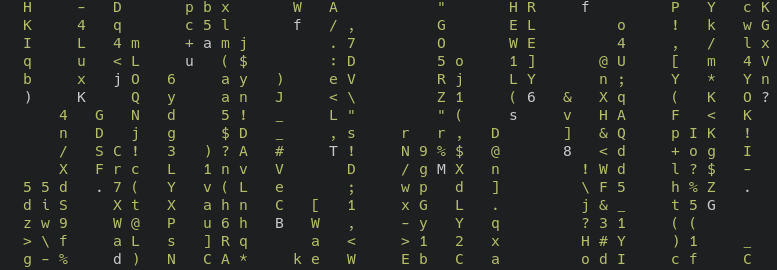

# cmatrix

cmatrix continously displays random text on a terminal screen.

## Usage
- cmatrix [options]

## Options
- **-c** Use Japanese characters. Requires appropriate fonts.
- **-C [color]** Set color.
- **-r** Rainbow mode

## Source code
cmatrix is in development. You can view its source code
[here.](https://github.com/abishekvashok/cmatrix)

*Page added on 2021-10-21, last edited on: 2021-12-21*

