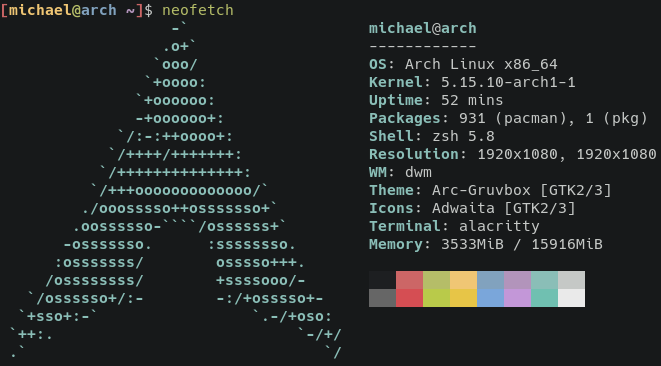

# neofetch

neofetch displays system information.

## Source code
neofetch is in development. You can view its source code
[here.](https://github.com/dylanaraps/neofetch)

*Page added on 2021-10-21, last edited on: 2021-12-21*

