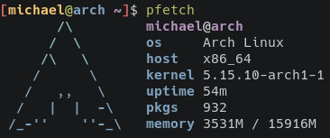

# pfetch

pfetch displays system information in a much prettier and more concise manner
than neofetch.

## Source code
pfetch is in development. You can view its source code
[here.](https://github.com/dylanaraps/pfetch)

*Page added on 2021-10-21, last edited on: 2021-12-21*

