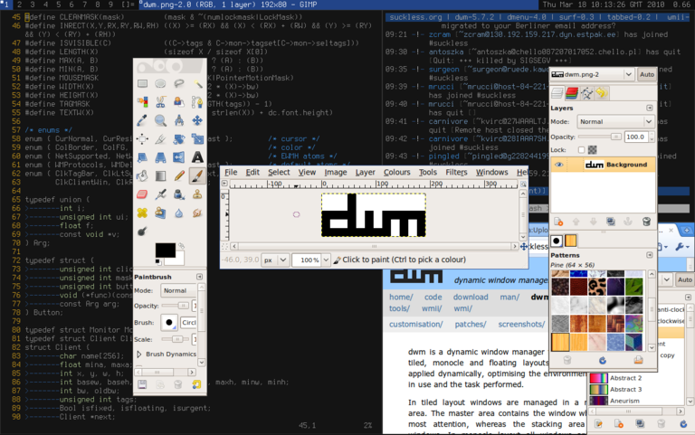

# dwm

dwm is a dynamic window manager for the X window system.

## Installation
- git clone https://git.suckless.org/dwm
- cd dwm
- make clean install

## Usage
- The tutorial can be found [here.](https://dwm.suckless.org/tutorial/)
- dwm must be recompiled, reinstalled, and restarted after revisions for changes to take effect.
- Changes can be applied to dwm through patches.

## Source code
dwm is in development. You can view its source code [here.](https://git.suckless.org/dwm)

*Page added on 2021-10-20*

